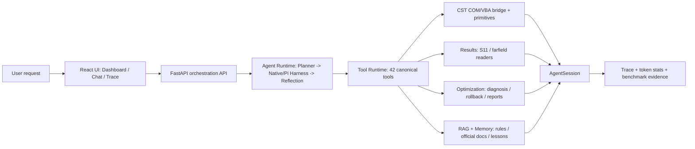

# CST-Agent Architecture Story

This document is the architecture story of the project: how the system works and why it is built this way, told as an Agent application rather than a collection of CST utilities.

## 1-Minute Pitch

我做的是一个面向 CST Studio Suite 的垂直工程 Agent，核心目标不是聊天，而是打通电磁仿真的闭环：用户用自然语言提出天线设计需求，Agent 先规划任务，再通过受控工具调用生成 CST 模型、运行或读取仿真结果、诊断 S11/远场指标，并在优化过程中记录 trace、memory、reflection 和 benchmark evidence。

这个项目的重点是 Agent 工程化：Planner/Executor 分离、统一 Tool Runtime、真实外部工具集成、状态与记忆管理、失败可观测、结果可评估。它和普通 RAG chatbot 最大的区别是：RAG 只是知识来源之一，真正的主线是“Agent 控制真实工程软件并形成可验证闭环”。

## Architecture Story

The core architecture can be explained in five layers:

- **Interaction layer**: React pages expose the agent as an engineering workbench, not just a chat box.
- **API layer**: FastAPI separates chat, CST actions, optimization, results, trace, settings, and RAG endpoints.
- **Agent runtime**: FastAPI chat calls `agent.chat()` directly, which runs planner → pluggable executor Harness → reflection. Native remains the default self-authored loop; restricted Pi Agent Core can own model turns and sequential continuation without receiving COM, shell, or mutable Session access. `AgentSession` remains the single runtime state owner.
- **Tool runtime**: all 42 canonical tools share one execution path for dispatch, result caching, error classification, and trace.
- **Domain layer**: CST bridge, results readers, optimization strategy, RAG, and reports stay outside the agent orchestration layer.

## End-To-End Workflow

A typical flow is:

1. User asks for a rectangular patch antenna at a target frequency.
2. Planner creates a structured intent and steps.
3. Executor selects either deterministic fast path or LLM tool-calling path.
4. Tool Runtime calls CST primitives or fast builders and records tool events.
5. CST bridge executes controlled VBA through COM or returns dry-run artifacts.
6. Results service reads S11/farfield data and summarizes resonance, bandwidth, and target metrics.
7. Optimizer diagnoses whether to tune frequency or matching, proposes parameter updates, and rolls back if metrics degrade.
8. Reflection writes confidence-gated lessons and failures once into canonical StructuredMemory; legacy dynamic JSON is migration-only and is not double-written.
9. Dashboard/Trace/report expose what happened, why it happened, and whether it improved.

## Key Technical Decisions

### Planner / Executor Separation

The production chat route calls `agent.chat()` directly. `agent.chat()` owns plan creation, then delegates execution to `run_agent_turn`; the active step contributes a safe tool allowlist and executable stop conditions. The executor still runs a whole-turn tool loop rather than exactly one tool per plan step, so step-level single-tool driving remains future work.

### Hybrid Agent Instead Of Pure LLM

Standard antenna structures use deterministic fast paths. This reduces LLM drift, improves reproducibility, and makes snapshot testing possible. LLM tool calling remains useful for flexible modeling and diagnosis tasks.

### Tool Runtime As Control Plane

All tools go through the same runtime. That runtime is responsible for:

- tool dispatch;
- full result caching with lightweight summaries sent back to the model;
- error classification;
- trace hooks;
- session artifact updates;
- recall of full payloads when summaries are not enough.

### Tiered Autonomy: Parameter-Bound Approval

Typed modeling tools, solver runs and result reads execute autonomously because they cannot escape the canonical schema and controller protections. The only tool that can — `execute_vba_script` — requires human approval before dispatch (ADR-011). A grant binds `(tool name, normalized-argument SHA-256, actor, expiry)` and is consumed exactly once before the handler runs; any argument change produces a new request, and clearing the session or switching projects revokes pending requests and active grants. A pending approval keeps the plan step `in_progress`: it is neither a tool failure nor step completion, and the approve API re-runs the allowlist/schema/hash preflight on server-stored arguments before issuing the grant (ADR-013). The stated boundary is honest: approval replays the exact tool call, it does not pause and resume the original model turn.

### Pluggable Execution Harness (Native / Pi)

The tool loop inside `runtime.run_agent_turn()` sits behind a `loop_runner` boundary (ADR-009). Native remains the default self-authored Python loop; `AGENT_BRAIN=pi` hands model turns, sequential tool continuation and message conversion to a restricted Node sidecar running pi-agent-core. The sidecar speaks a versioned `hello/health/run/result/error` protocol with capability negotiation, heartbeats, ordered events and correlated cancel/steer; it never receives COM handles, built-in coding tools or the mutable Session, and every tool call re-enters `tool_runtime.execute_tool`. Failures stay explicit — a missing or timed-out sidecar never silently falls back to Native, and a crashed sidecar restarts only before the next task, because replaying a turn with real CST side effects is not idempotent. On the paired 12-case × 3-repeat Terra comparison Pi leads task-majority 12/12 vs 10/12, but exact McNemar p=0.5 keeps that directional, not significant.

### Failure Recovery Engine

The layer above the tool runtime turns classified tool failures into auditable recovery attempts. The `FailureRecoveryEngine` (see `agent/failure_recovery.py`) registers bounded, domain-specific recovery actions:

- reconnect to CST after connection failures;
- retry bounded timeout failures;
- auto-create a missing farfield monitor before retrying a result read;
- fill missing parameter values from the current model state;
- accept dry-run fallback when CST is offline.

Each recovery attempt is bounded by per-action attempt counters and written into the tool event trace, so the frontend can show a full failure → recovery → retry chain. This is the project's current answer to the "what happens when a real engineering tool fails" question.

### Agent Memory And Reflection

The agent separates three responsibilities. Conversation memory retains explicit goals, constraints, pending questions and project scope across follow-up turns. Canonical StructuredMemory stores project/design-scoped lessons and failures after confidence/evidence gates. Persistent procedural `ToolUseMemory` records tool failures, corrections and positive metric deltas, then injects guidance and reorders only tools already permitted by the active plan. It cannot add capabilities or bypass the static safety boundary.

### Official-Documentation RAG

The document RAG is a real end-to-end pipeline over CST Studio Suite 2025 Online Help rather than a mock knowledge list:
4,480 HTML candidates → DOM cleaning → 1200/200 boundary-aware chunks → BGE-base embeddings → Chroma cosine HNSW
Top-20 → MiniLM cross-encoder → source deduplication → structured provenance → Planner, Executor and Trace. The schema-v4 index contains 13,242 chunks from
3,886 content-bearing pages and passes a separate-process cold-start query.

The engineering lessons matter more than the model name: a splitter boundary bug once produced 210 near-duplicate chunks
from an 8,493-character page; Windows native HNSW silently failed under a non-ASCII persist path; and a Chinese embedding
model was mismatched with the English corpus. These were addressed with minimum-progress chunking, an ASCII-only D-drive
index, cold-start validation, an English BGE-base query/passage contract, explicit Chinese-to-English retrieval queries,
multi-query fusion, reranking before source-level dedup, and dense fallback. On the frozen 30-case held-out v1, reranking
improves Recall@3 from 0.900 to 0.967, MRR from 0.750 to 0.794 and nDCG@3 from 0.754 to 0.817; the 2026-08-10 warm p95
rises from 63.29 ms to 1019.50 ms. MiniLM was selected over BGE-reranker-base because it was slightly better and about
6.2× faster on that CPU run. Dataset SHA, index identity and presets are machine-verified before retrieval.

### Evaluation First

The project includes offline tests, VBA snapshots, fake-CST ablation, API route tests, frontend build/tests, and real-CST matrix/report commands. Real CST cannot run in hosted CI, so CI covers offline behavior and live CST remains a local workstation verification path. On Windows the project supports both the official `cst.interface` Python API and the documented `CST DESIGN ENVIRONMENT.exe` batch entry point. The latter enables unattended solver smoke with process exit-code evidence; it is not described as fully headless because the Windows documentation does not guarantee that no Design Environment window/process is created.

The full-Agent harness is distinct from the older optimization-proposal benchmark: it always enters through real `CSTAgent.chat()` and keeps Planner, context, the production tool loop, Recovery, Session and Trace intact while replacing only the CST COM boundary. The grader separates execution success from lexical grounding and enforces manifest SHA, family coverage, empty allowlists, zero-tool limits, exact sequences, arguments and injected-failure consumption. The developer-visible 40-case v1 deterministic run is full 40/40, no-context execution 40/40 but strict-grounded 32/40, no-recovery 32/40 and no-planner 0/40. No-memory and no-ToolUseMemory remain 40/40, so the scripted provider cannot prove memory gain. A real Terra v1 audit exposed lexical/argument false negatives plus one under-specified solver failure; its semantic-audit v2 now binds the exact source report, review, manifest and auditor bytes and verifies manifest case order. The explicit post-audit v2 regression is execution 7/7, exact sequence 7/7, invalid calls 0 and strict lexical 6/7. Neither set is blinded, and v2 is not unseen-model evidence. `ToolUseMemory` has a deterministic production write/persist/scoped-recall/safe-rerank pair, but no real-model held-out lift claim.

The sealed-evaluation verifier exists to prevent a stronger claim from being created by local self-signing. Legacy v1 HMAC is now integrity-only and can never grant execution or release. v2 selects `(issuer, key_id, algorithm, usage)` only from an external trust policy, verifies `not_before` plus public cases/fixtures/runner/prompt/tool bytes, and emits a stable path-free public receipt with execution eligibility only. Private verification must bind the same manifest and public receipt. Final promotion separately requires a promotion-capable key, recomputes full `case × arm × repeat` coverage from response-trace JSONL, binds every provider request/response/trace SHA and the public/private reports, and is the only path that can return release eligibility. The repository has verifier tests but no externally issued pack or completed sealed Terra result, so this is engineering evidence, not a blinded effect claim.

The Memory benchmark also keeps exact sequence and semantic success separate. A deterministic grader now treats required material calls as an ordered subsequence, checks arguments and tool success, permits only an explicit harmless read-only status check, and flags a success claim when the state transition failed. Zero-model-call revalidation reproduced the existing repeat-1 single review on all 16 responses, including one harmless-extra exact false negative and one wrong-axis unsupported success claim. On the 48-sample repeat-3 artifact, both arms remained 24/24 and all eight unique-case endpoints tied. This strengthens the grader without manufacturing a Memory lift; the revalidation is post-hoc, while future runner v3 fingerprints the grader before execution.

## Design Q&A Notes

### What was the hardest part?

The hardest part was controlling uncertainty across three boundaries at once: LLM planning uncertainty, CST COM/VBA execution uncertainty, and physical simulation uncertainty. The solution was not one prompt; it was a runtime design: controlled tools, trace, preflight checks, result summaries, rollback, and benchmark evidence.

### Why not use LangGraph?

LangGraph was evaluated for the orchestrator but withdrawn (ADR-001). The graph nodes became thin pass-throughs to runtime functions; checkpointer/thread_id were unusable because the agent contains COM handles and locks that cannot be serialized; the replan edge's set/clear conditions were mutually exclusive, making it unreachable in production. Self-authored control flow (planner → tool loop → reflection in `runtime.py`) does the same job with less indirection. The value of this decision is documented as an ADR — it shows engineering judgment about when a framework adds cost without capability.

### Why Pi Agent Core is a different decision

Pi replaces a substantive boundary—the executor's model turns, event stream and Tool Loop—behind a
`loop_runner` interface. It does not replace the Python Host control plane. Active-step catalogs are
refreshed after each tool batch; every call still enters `tool_runtime.execute_tool`; sequential mode
protects the single stateful CST project. Reports bind the selected Harness and implementation bytes.
Mechanical tests pass, but the current real-model sample is directional and does not establish Pi
quality or latency superiority; Native therefore remains the default. See `docs/PI_HARNESS_EVALUATION.md`.

### How do you keep tool calling safe?

The agent prefers controlled primitives and fast paths over free-form VBA. Tool execution is centralized, errors are classified, solver calls have preflight checks, and large tool outputs are cached in session artifacts while only concise summaries are passed back to the model. Raw VBA is the one exception to autonomy: it requires a parameter-bound, single-use human approval before dispatch (ADR-011/013).

### How does RAG help?

RAG is engineering context for planning, answering and tool-parameter decisions, not a substitute for executing CST. Curated
rules, official documents and runtime lessons stay as separate provenance channels. Official-document hits carry source path,
chunk and score into Planner, Executor and Trace; `history` recall cannot pull manual chunks and pretend they are learned
experience. Reflection lessons enter canonical StructuredMemory only through confidence, evidence and design-signature gates; legacy dynamic entries are migration-only.

### How do you evaluate whether the Agent works?

I separate evaluation into offline and live layers. Offline: unit/integration tests, planner tests, tool runtime tests, physics sanity checks, VBA snapshots, fake-CST ablation. Live: CST workstation runs for build success, result-read success, optimization improvement, rollback behavior, and report evidence.

### Why can real CST not run in CI?

CST Studio Suite and its COM interface require a licensed Windows desktop environment. Hosted GitHub runners do not provide that environment, so the CI validates everything around CST with fakes and dry-run artifacts, while live CST verification is run locally.

## Evidence To Show

- 42 canonical agent tools.
- Modular FastAPI REST + SSE endpoints.
- 1,156 offline tests passing, 2 live-CST tests deselected.
- React Dashboard / Chat / Trace UI.
- Fake-CST ablation runner and reports.
- CLI real-CST matrix and optimization report path.
- Runtime trace with tool calls, token stats, active plan state, and VBA artifacts.
- Full-Agent deterministic and real-provider directional ablation reports, with dataset SHA and honest boundaries.
- Raw-VBA approval control plane E2E: zero dispatch before approval, hash-bound single-use grant, re-approval on any argument change (registry-bound report).
- Sealed-evaluation verifier and adversarial tests: v1 downgrade, trusted v2 execution receipt, private binding and promotion-only release gate.
- CST official-document RAG: 13,242 chunks, schema/model identity checks, cold-start validation, frozen retrieval and Agent-groundedness reports.

## Module Map

- `agent/`: planning, execution, memory, reflection, trace, and tool runtime.
- `cst/`: real CST COM/VBA bridge and controlled modeling primitives.
- `optimization/`: S11 diagnosis, optimization loop, rollback, and report evidence.
- `rag/`: expert rules, CST official-document retrieval, confidence gate, and memory-backed lessons.
- `results/`: S11/farfield reading and fallback chain.
- `frontend/`: Dashboard, Chat, and Trace as the agent observability surface.
- `tests/`, `benchmarks/`, and CI: proof that the agent is evaluable.

## Honest Boundaries

- The supported UI is React + FastAPI; the old Gradio implementation is absent from the production tree.
- The old 12-case set remains a development pilot. The frozen 30-case retrieval set uses controlled English queries;
  live query translation and full Planner/Executor groundedness are measured only on a fixed six-case selection.
  Terra v2 completed 6/6 Agent responses, while the strict claim judge was schema-valid on 5/6; 55 valid claims yielded
  macro groundedness 0.766 and unsupported rate 30.9%. Those are uncalibrated development diagnostics, not headline
  effects. The v2 runner binds atomic claims to answer/evidence SHA and exact Top-3 refs. The current exporter produces
  two 55-claim verdict-blind packs from the revalidated report, binds A/B/adjudication to one `pack_id` plus the exact
  rubric bytes, and permutes the original report order. Natural IDs and source identities remain visible, so this is not fully provenance-blind; real
  independent human annotations have not yet been collected.
- Some real CST optimization cases still need stronger diagnosis-driven tuning before consistently reaching target S11.
- Farfield extraction has CST template/COM context limitations, so the implementation uses a fallback chain.
- LangGraph has been withdrawn (ADR-001); the agent uses self-authored control flow. Step-level single-tool driving is future work.
- The default ablation runs use a deterministic proposal proxy (mechanism smoke, no real LLM). The fake-CST 20-case report shows heuristic_only 70% vs **llm_no_memory 100% vs llm_with_memory 100%**, with `memory_enforced_rate = 0.0` — so the 70%→100% delta is the LLM-shaped proposer, **not** memory. In the real-LLM 20-case deepseek run memory is recalled and enforced (hit/enforced rate 1.0) but all groups still reach 100%, i.e. memory's value is not demonstrated by these benchmarks. The fake-CST harness also injects domain-prior lessons that match the simulator's `f ∝ 1/L` law by construction, so with-memory wins there would be near-tautological. The 10-pair keyword-fallback test remains only a regression check; official-document claims must use the frozen 30-case retrieval reports and fixed 6-case Agent-groundedness report above.
- The full-Agent deterministic 40-case run is a production-path mechanism regression, not model-quality evidence. Both Agent sets are developer-visible; v2 explicitly used v1 Terra outputs to revise oracles. The seven-case Terra runs are too small for statistical claims, and ToolUseMemory currently shows safe integration rather than measured success-rate improvement.
- Sealed verifier implementation does not itself prove independent custody. Until an external issuer owns the oracle and promotion key and supplies a one-shot pack, do not call any current result blinded or sealed.
- BO/PSO/DE is a bounded fallback sampler for when LLM proposals are unavailable — do not present it as "implemented Bayesian optimization" in the strong sense.
- The FastAPI backend is a single-user desktop tool (one global session, one operation lock, no auth).
- The project is a strong vertical Agent prototype, not a fully packaged commercial CST plugin.
