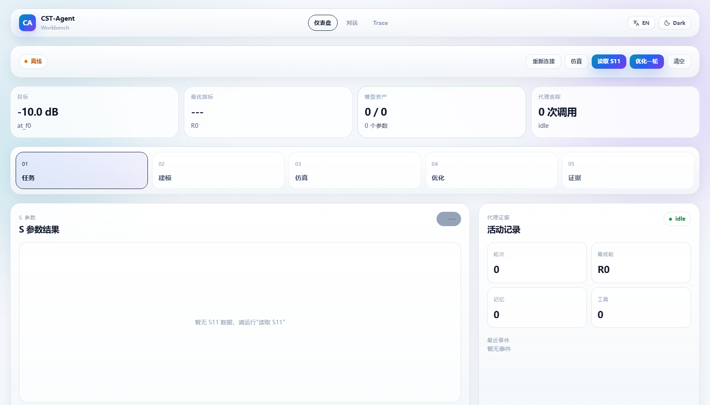
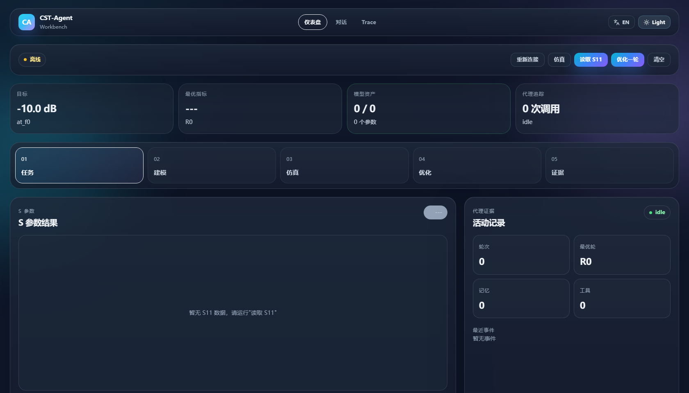
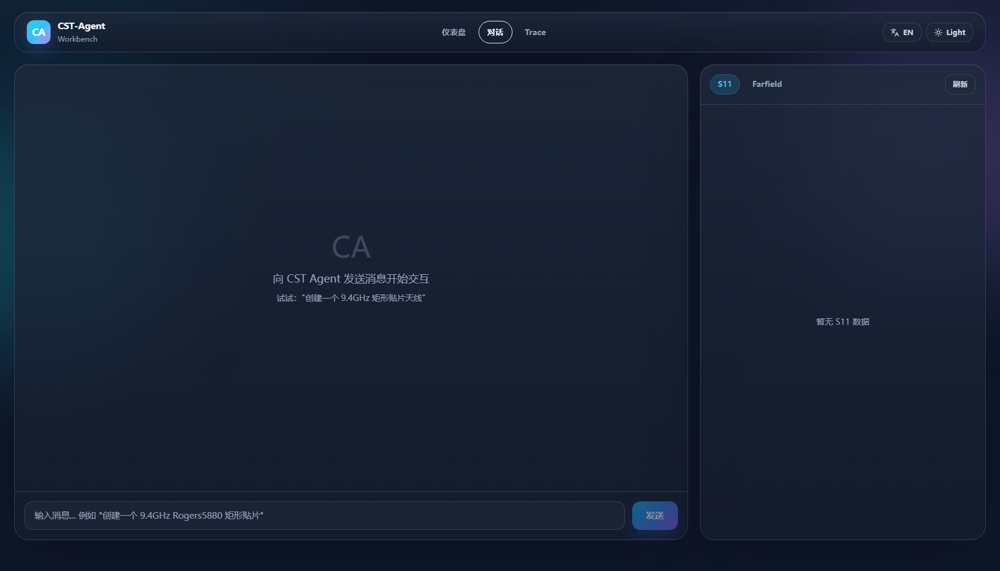

# Agent Workbench

[](LICENSE)

Repository: [github.com/ncdeng/agent-workbench](https://github.com/ncdeng/agent-workbench)

**The hard part is not calling an LLM API. It is what surrounds the call**: managing side effects in a live desktop application the agent does not own, recovering from external-process failures without pretending otherwise, gating high-risk operations behind parameter-bound approval, and producing evaluation evidence that can be recomputed byte-for-byte.

**Agent Workbench** is a vertical engineering Agent runtime that operates CST Studio Suite 2025 — a real, stateful desktop CAE application — through a Windows COM bridge. It turns a natural-language engineering requirement into a traceable closed loop:

`User request -> Planner -> Tool Runtime -> CST modeling/solver -> Result reading -> Diagnosis/optimization -> Trace/report evidence`

This repository is best understood as an **Agent application for a real engineering tool**, not as a generic RAG chatbot or a thin UI wrapper.

> The architecture story is in [PROJECT_STORY.md](PROJECT_STORY.md); the double-review workflow is in [docs/HUMAN_EVALUATION_RUNBOOK.md](docs/HUMAN_EVALUATION_RUNBOOK.md).

---

<p align="center">
  
</p>

<p align="center">
  <em>Dashboard: S11 chart, optimization metrics, CST status, recent tool events, and workflow progress</em>
</p>

<p align="center">
  
  &nbsp;
  
</p>

<p align="center">
  <em>Left: dark theme dashboard | Right: agent chat with result viewer</em>
</p>

## Why This Is Hard

The tool surface is a stateful desktop engineering application, not a stateless web API. Three consequences drive most of the design:

- **A single mutable resource.** A CST project is shared, stateful, and changed irreversibly by modeling and solver calls. Tool execution is therefore sequential, the active plan constrains which tools are visible at each step, and a failed step leaves real state behind that recovery has to reason about — not just an HTTP error code.
- **COM subprocess isolation.** CST's COM interface has Windows STA thread affinity and a locked Python version, so all COM/VBA work runs in a dedicated subprocess bridge; COM handles are released with the process instead of living inside the agent. The accepted cost is a subprocess hop on every command.
- **No fake aborts (ADR-006).** On a bridge timeout, Python can kill its own subprocess — but the CST Design Environment is a separate OS process that may still be running the previous solve, and CST exposes no reliable cross-process abort API. The runtime degrades honestly: it marks the connection dead so the next command reconnects, returns `timeout: True`, and tells the user that CST may still be executing the previous solve. It does not claim an abort it cannot perform.

## Agent Architecture

```
┌─────────────────────────────────────────────────────────────────────┐
│ User / React UI                                                     │
│ Dashboard · Chat · Trace                                            │
└──────────────────────────────┬──────────────────────────────────────┘
                               │ REST + SSE
┌──────────────────────────────▼──────────────────────────────────────┐
│ FastAPI Orchestration API                                           │
│ chat · cst actions · optimization · results · trace · RAG           │
└──────────────────────────────┬──────────────────────────────────────┘
                               │
┌──────────────────────────────▼──────────────────────────────────────┐
│ Agent Runtime                                                       │
│ Planner → pluggable Tool Loop (Native / restricted Pi) → Reflection │
│ structured Plan · conditional routing · replan/reflect/end          │
└──────────────────────────────┬──────────────────────────────────────┘
                               │
┌──────────────────────────────▼──────────────────────────────────────┐
│ Tool Runtime: 42 canonical tools, one execution entry               │
│ active-step allowlist · schema validate · approval gate · dispatch  │
│ error typing · summarize/recall · token budget · trace hooks        │
└───────────────┬───────────────┬────────────────┬────────────────────┘
                │               │                │
┌───────────────▼───┐ ┌─────────▼──────┐ ┌───────▼────────┐ ┌─────────▼──────┐
│ CST Domain Tools  │ │ Results Service│ │ Optimization   │ │ RAG + Memory   │
│ COM/VBA bridge    │ │ S11/farfield   │ │ diagnosis      │ │ expert rules   │
│ primitives        │ │ fallback chain │ │ rollback       │ │ official docs  │
│ fast paths        │ │ summaries      │ │ reports        │ │ reflection     │
└───────────────┬───┘ └─────────┬──────┘ └───────┬────────┘ └─────────┬──────┘
                └───────────────┴────────────────┴────────────────────┘
                                │
┌───────────────────────────────▼─────────────────────────────────────┐
│ AgentSession                                                        │
│ single source of truth · artifacts · tool results · trace history   │
│ structured memory · benchmark/report evidence                       │
└─────────────────────────────────────────────────────────────────────┘
```

## Tool Runtime Control Plane

All 42 canonical tools execute through one entry point, `tool_runtime.execute_tool`; no harness gets a second dispatch path. Every call — normal or recovery — passes the same pipeline:

`active-step allowlist -> schema normalize/validate -> approval gate -> dispatch -> typed result`

- **Permission vs. completion (ADR-010).** The planner's `allowed_tools` is only a whitelist; a separate `required_tools` subset is an all-of completion contract. The runtime accumulates `completed_tools` across batches and injects `remaining_required_tools` back into plan context, so a step no longer completes just because any single call happened.
- **Schema-driven calling.** Arguments are validated against canonical JSON Schemas; optional defaults are applied before validation, hashing, and evaluation, so an omitted flag and an explicit `false` are the same call at every layer.
- **Error classification and recovery.** Failures are typed, and a `FailureRecoveryEngine` registers bounded actions — reconnect, timeout retry, farfield-monitor auto-repair, parameter repair, dry-run fallback. Recovery itself goes back through the allowlist/schema/approval gate, and every recovery and retry outcome is attached to the tool event and the trace, forming an auditable chain.
- **Large results.** Oversized payloads are summarized with full-payload recall (`recall_tool_result`) instead of flooding the context; 1D/S-parameter curves can be deterministically downsampled with endpoints and global extrema preserved, and scalar summaries are always computed on the full raw curve (ADR-012).
- **Trace hooks.** Tool calls, token usage, recovery, and approvals land in one run-level trace shared by chat and programmatic optimization rounds (ADR-008).

## Tiered Autonomy: Typed Tools Run, Raw VBA Asks

Autonomy is tiered by what a call can bypass:

- **Typed tools are autonomous.** Canonical modeling, solver, and result-reading tools execute without human approval because their arguments are bounded by the canonical schema and the controller's own guards.
- **Raw VBA is approval-gated (ADR-011).** `execute_vba_script` can bypass both, so it requires a grant bound to `(tool_name, SHA-256 of canonical normalized arguments, actor, expiry)`. Schema defaults are normalized before hashing and object key order does not affect the hash. A grant is consumed before the handler runs and works exactly once: a CST-side failure still requires re-approval, and any argument change produces a new request.
- **No stale grants.** The approval endpoint holds the exact arguments server-side (the UI sees a preview of at most 500 characters), re-runs the side-effect-free allowlist/schema/hash preflight before issuing, and clearing the session or opening/closing a project revokes all pending requests and active grants.
- **Pending is neither failure nor completion (ADR-013).** `approval_pending` keeps the plan step `in_progress`, and only successfully executed tools count toward `completed_tools`. The approve endpoint replays the exact bound call in the same HTTP request; the honest description is "parameter-bound approval with exact-replay execution", not "pause/resume reasoning".
- **Single-user scope.** This is a local single-user desktop application: the actor is fixed to `local-desktop-user`, there is no multi-tenant authentication, and nothing here should be read as RBAC or enterprise authorization.

## Pluggable Harness: Native and Pi

The tool loop inside `run_agent_turn()` is a replaceable component (ADR-009). `AGENT_BRAIN=native` (default) keeps the self-authored Python loop; `AGENT_BRAIN=pi` delegates model turns and tool-loop continuation to a restricted Node sidecar running the MIT-licensed pi-agent-core. Planner, session state, recovery, trace, and the CST COM boundary stay in Python under both. See [`integrations/pi_agent_core/README.md`](integrations/pi_agent_core/README.md).

- **Restricted sidecar.** Pi does not load pi-coding-agent and exposes no Bash/Read/Write/Edit/Web/MCP built-ins; it sees only the current active-step subset of the canonical tool catalog, re-filtered by Python after every batch. Each tool call returns to `execute_tool`, so allowlists, approval, recovery, trace, and COM isolation apply identically — and Pi never holds a mutable session or a COM handle. Because a CST project is a single stateful resource, tool execution is forced sequential.
- **Versioned control protocol.** `hello/health/run/result/error` envelopes, request/session dual correlation, capability negotiation, a long-lived sidecar session registry with heartbeat/generation, ordered harness events, and correlated cancel/steer/follow-up.
- **Failure semantics.** A missing sidecar, timeout, malformed JSONL, or model error all fail explicitly — there is no silent fallback to Native, so evaluations and traces never mis-attribute the harness. After a crash the sidecar restarts before the next task; a possibly half-executed CST turn is never auto-replayed.
- **Measured so far, with boundaries.** The latest real-model pairing (`gpt-5.6-terra`, 12 unique cases x 3 repeats, developer-visible and post-audit) gives task-majority Pi 12/12 vs Native 10/12 and strict-majority 10/12 vs 7/12, concentrated in two solver workflow families — but exact McNemar is p=0.5 / 0.25, the all-repeats endpoints are identical (9/12 and 5/12), and mean tokens are flat (Pi +1%). Repeats are correlated, so the statistical unit is 12 cases. This is directional improvement on complex tasks, not a significant or general quality claim; Pi's certain value today is the protocol, isolation, recovery, observability, and control plane. SHA-bound detail: [docs/PI_HARNESS_EVALUATION.md](docs/PI_HARNESS_EVALUATION.md).

## Evaluation Discipline

Numbers in this repository are evidence, and the rules around them are part of the work:

- **SHA-bound evidence chain.** The Agent evidence registry, [benchmarks/agent_e2e_canonical.json](benchmarks/agent_e2e_canonical.json), byte-binds the frozen v1/v2 datasets and manifests, the 40-case deterministic run, the Terra repeat-3 run, semantic-audit v2, and the post-audit v2 report. Older ten-case development reports are marked historical diagnostics, not evidence.
- **Frozen sets and ablations.** The full-Agent harness enters through `CSTAgent.chat()` and replaces only the CST boundary. On the manifest/SHA-bound 40-case developer-visible deterministic v1: full 40/40, no-context execution 40/40 but strict-lexical 32/40, no-recovery 32/40, no-planner 0/40. The no-memory and no-ToolUseMemory arms are both 40/40 — so this run demonstrates the mechanism and the planner/recovery contributions, and explicitly does not show a memory gain.
- **Real-model audits with the corrections on record.** The first Terra v1 audit (7 representative cases) exposed lexical/argument false negatives and one under-specified solver failure; the post-audit v2 regression — which records that v1 outputs informed oracle revisions — scores execution 7/7, exact sequence 7/7, invalid calls 0, strict lexical 6/7. A response-SHA-bound semantic review of the 3-repeat run scores execution 19/21 and grounded task 16/21. Three repeats are correlated, not 21 independent tasks, and none of these sets is blinded.
- **Null results are kept, not deleted.** The real-model ToolUseMemory A/B (four failure families, 8 cases x 2 arms x 3 repeats) injected memory in 24/24 learned-arm samples and changed first-turn tool ordering — yet both arms finished 24/24 with paired delta 0, zero invalid calls, and roughly 220 extra learned-arm tokens. It stays in the repository as a preserved null result; its tail latency is excluded from causal comparison for documented reasons.
- **Sealed evaluation is a protocol, not a result.** The v2 sealed-eval verifier binds an external trust policy to the real bytes of the public cases, fixtures, runner, prompts, and tool catalog, and grants only execution eligibility; release eligibility requires a separately trusted promotion receipt over the response trace. The repository contains no real external issuer, no private oracle custody, and no completed sealed run — the claim is "protocol implemented and negative-tested", never "blinded or sealed evidence obtained". See [docs/SEALED_EVALUATION_PROTOCOL.md](docs/SEALED_EVALUATION_PROTOCOL.md).
- **Human calibration is pending.** The exporters produce source-bound, verdict-blind A/B packs (21 Agent samples, 55 RAG claims) with a common `pack_id`, SHA-bound permutations, and rubric bytes for dual-reviewer calibration; natural sample/case/claim IDs are retained, so the packs are not described as fully provenance-blind. Until independent labeling completes, LLM-judge scores (e.g. RAG macro groundedness 0.766 with 17/55 unsupported claims) remain development diagnostics, not effect claims. Runbook: [docs/HUMAN_EVALUATION_RUNBOOK.md](docs/HUMAN_EVALUATION_RUNBOOK.md).

## The Engineering Substrate: CST Studio Suite

CST is the substrate that makes the agent engineering real — a live desktop solver with genuine side effects — not the research goal itself. On top of the COM/VBA bridge, the project ships deterministic fast-path builders for standard antennas (rectangular patch, half-wave dipole, pixel patch) so routine requests skip LLM drift, with tool calling available for open-ended tasks. The closed loop is solver execution, S11/farfield reading with a fallback chain, `diagnose_s11` triage, and physics-guided tuning: f∝1/L secant step sizing, direction memory, rollback validated by a real re-solve, and stagnation detection that restores the best-so-far point. Where the CST Native Optimizer is used, the split of labor is explicit: the agent interprets the physical goal, diagnoses results, configures objectives, and owns rollback; the native optimizer does numerical search; the solver remains the physical ground truth (ADR-014). The full loop — modeling -> solve -> S11 diagnosis -> tuning with rollback -> evidence on disk — exists as evidence for the control plane above, and the CLI report commands below exercise it end to end.

## RAG and Memory

Two retrieval channels exist, and they are not the same system; their numbers should not be merged.

### Official-document RAG

CST Online Help HTML is chunked into 13,242 English schema-v4 chunks embedded with `bge-base-en-v1.5` in Chroma. Retrieval is dense Top-20 -> `ms-marco-MiniLM-L6-v2` cross-encoder rerank -> source dedup to Top-3, with full rank/provenance tracing. On the frozen 30-query held-out v1 set, reranking improves Recall@3 0.900 -> 0.967, MRR 0.750 -> 0.794, and nDCG@3 0.754 -> 0.817; the orthogonal ablation shows dedup alone moves 0.800 -> 0.900, with the cross-encoder needed for 0.967. Only 2/30 queries actually changed outcome, and the paired-bootstrap 95% CI for the Recall delta is [0.000, 0.167] — the cross-encoder gain is directional, not statistically significant. Warm p95 latency rises 63.29 -> 1019.50 ms as a same-machine observation. Design and full numbers: [docs/RAG_DESIGN.md](docs/RAG_DESIGN.md).

### Agent memory

- **StructuredMemory** is the single production store for reflection lessons and failures, scoped by project and design signature, gated by confidence/evidence with a `min_score` and a keyword fallback; rollback rounds are written at reduced confidence (0.2). The legacy dynamic JSON is read only through an explicit migration switch; new reflections are never double-written there.
- **ToolUseMemory** recalls past tool failures and corrections and safely reorders only the active-step allowlist — it never expands permissions. The production write/persist/scoped-recall/safe-rerank loop is proven end to end; a real-model behavioral lift is not (see the preserved null result above).
- **Conversation context.** Explicit goals, constraints, and pending questions survive follow-up turns; token budgeting counts messages and tool schemas together.

## Engineering Boundaries

These are intentional constraints of integrating with a real desktop engineering tool:

- Real CST solver and COM tests require a local Windows workstation with CST Studio Suite; GitHub CI runs offline tests only.
- Farfield post-processing may require CST result templates because some live VBA plot paths have COM context restrictions.
- Real CST optimization is observable and rollback-safe, but some 9.4 GHz Rogers5880 microstrip cases still need stronger diagnosis-driven tuning before reliably meeting `S11@f0 <= -10 dB`.
- LangGraph has been withdrawn (ADR-001): the graph nodes were thin pass-throughs of runtime functions, the checkpointer was unusable because the agent holds non-serializable COM handles, and the replan edge was unreachable on the production path — so the agent uses self-authored control flow (planner -> tool loop -> reflection). Step-level single-tool driving is future work.
- The Native-vs-Pi real-model pairing exists but is small: 12 unique cases x 3 repeats, developer-visible, post-audit, with correlated repeats. It shows directional improvement on solver workflows (exact McNemar p=0.5 / 0.25) — not statistically significant, not blinded or sealed, and not release-eligible. Native remains the default and the rollback baseline.
- Chat SSE reports tool events by polling session state every 0.5s; it is not token-level streaming.
- The FastAPI backend is a single-user desktop tool: one global agent/session guarded by one operation lock, and no authentication. Keep it bound to `127.0.0.1`; do not expose `--host 0.0.0.0` on untrusted networks.
- The deterministic provider is a mechanism regression, not LLM-quality evidence. The 40-case Agent sets are developer-visible; v2 explicitly records that Terra v1 outputs informed oracle revisions. The seven-case Terra runs are directional, not statistically powered or blinded. ToolUseMemory has a production write/persist/scoped-recall/safe-rerank mechanism pair, but no real-model held-out success-rate lift has been demonstrated.
- The BO/PSO/DE module is a bounded sampler used as a last-resort fallback when LLM proposals are unavailable; it is not a full optimization-loop replacement and should not be presented as one.
- The Gradio implementation has been removed from the production tree. Some old scripts and optional dependency declarations remain cleanup candidates; the supported UI is React + FastAPI.

## Quick Start

> Verified local Python versions: 3.11 and 3.14. Use Windows for live CST mode.

```bash
# Install package + optional feature dependencies
pip install -e .[dev,web,report,rag]

# Configure LLM provider
copy .env.example .env
# Edit .env: set MODEL_API_KEY/MODEL_NAME (or legacy OPENAI_*), then choose
# chat_completions, responses, or anthropic_messages with MODEL_API_PROTOCOL.
# Protocol and cache boundaries: docs/MODEL_PROTOCOLS_AND_CACHE.md

# Launch React frontend + FastAPI backend
启动.bat

# Or launch backend manually
python -m cst_agent_workbench.web_app              # live CST mode
python -m cst_agent_workbench.web_app --dry-run    # demo mode without CST
```

Open `http://127.0.0.1:5173` for the React UI.

On Windows, pin package, model, RAG, memory, and temporary caches to the D drive before installing or evaluating:

```powershell
$env:CST_AGENT_DATA_ROOT="D:\cst_agent_rag_data"
$env:PIP_CACHE_DIR="$env:CST_AGENT_DATA_ROOT\cache\pip"
$env:HF_HOME="$env:CST_AGENT_DATA_ROOT\cache\huggingface"
$env:HF_HUB_CACHE="$env:HF_HOME\hub"
$env:TRANSFORMERS_CACHE="$env:CST_AGENT_DATA_ROOT\cache\transformers"
$env:SENTENCE_TRANSFORMERS_HOME="$env:CST_AGENT_DATA_ROOT\cache\sentence_transformers"
$env:RAG_CACHE_DIR="$env:CST_AGENT_DATA_ROOT\cache\rag"
$env:CHROMA_PERSIST_DIR="$env:CST_AGENT_DATA_ROOT\indexes\chroma"
$env:AGENT_MEMORY_DIR="$env:CST_AGENT_DATA_ROOT\memory"
$env:TEMP="$env:CST_AGENT_DATA_ROOT\tmp"
$env:TMP="$env:CST_AGENT_DATA_ROOT\tmp"
New-Item -ItemType Directory -Force $env:PIP_CACHE_DIR,$env:HF_HOME,$env:HF_HUB_CACHE,$env:TRANSFORMERS_CACHE,$env:SENTENCE_TRANSFORMERS_HOME,$env:RAG_CACHE_DIR,$env:CHROMA_PERSIST_DIR,$env:AGENT_MEMORY_DIR,$env:TEMP | Out-Null
```

These settings are an execution prerequisite, not evidence metadata by themselves. Formal RAG runs still verify the canonical dataset/index/model contract recorded in their manifest.

Useful CLI evidence commands (datasets, manifests, and reports are SHA-bound per the evaluation discipline above; human-calibration pack exports follow [docs/HUMAN_EVALUATION_RUNBOOK.md](docs/HUMAN_EVALUATION_RUNBOOK.md)):

```bash
# Generate deterministic patch VBA without CST
python -m cst_agent_workbench.cli build-patch --dry-run --f0 9.4 --er 2.2 --h 1.6 --loss 0.0009 --material Rogers5880 --export-vba runs/demo/generated.vba

# Real CST closed-loop report
python -m cst_agent_workbench.cli optimize-patch-report --f0 9.4 --er 2.2 --h 1.6 --loss 0.0009 --material Rogers5880 --max-rounds 3 --output runs/demo/patch_optimization_report.md

# Real CST evaluation matrix
python -m cst_agent_workbench.cli patch-matrix --microstrip-rounds 3 --output-dir runs/patch_matrix --summary runs/patch_matrix/summary.md --json-output runs/patch_matrix/summary.json

# Optimization-proposal ablation (does not exercise the complete Agent runtime)
python benchmarks/agent_ablation_runner.py --cases 20 --max-rounds 6 --assert-thresholds --output benchmarks/reports/agent_ablation_fake_cst.json --summary-md benchmarks/reports/agent_ablation_fake_cst.md

# Full 40-case Agent mechanism evaluation with manifest/SHA and release gates
python -m benchmarks.agent_e2e_ablation_runner --dataset benchmarks/agent_e2e_frozen_dev_v1.json --manifest benchmarks/agent_e2e_frozen_dev_v1.manifest.json --full-frozen-eval --provider deterministic_proxy --artifact-root D:/cst_agent_rag_data/agent_e2e_frozen_artifacts --output benchmarks/reports/agent_e2e_frozen_dev_v1_deterministic_ablation_v2.json --summary-md benchmarks/reports/agent_e2e_frozen_dev_v1_deterministic_ablation_v2.md

# Real Terra representative regression (filtered/debug scope, not a full frozen release)
python -m benchmarks.agent_e2e_ablation_runner --dataset benchmarks/agent_e2e_frozen_dev_v2.json --manifest benchmarks/agent_e2e_frozen_dev_v2.manifest.json --provider openai_compatible --model gpt-5.6-terra --group full --case status_read_01 --case no_tool_01 --case memory_guided_01 --case context_followup_01 --case multi_tool_materials_01 --case disconnect_recovery_01 --case solver_workflow_01 --artifact-root D:/cst_agent_rag_data/agent_e2e_frozen_artifacts --output benchmarks/reports/agent_e2e_frozen_dev_v2_terra_regression_v1.json

# Repeat stability with atomic checkpointing; add --resume after an interrupted run
python -m benchmarks.agent_e2e_ablation_runner --dataset benchmarks/agent_e2e_frozen_dev_v1.json --manifest benchmarks/agent_e2e_frozen_dev_v1.manifest.json --provider openai_compatible --model gpt-5.6-terra --group full --repeat 3 --case status_read_01 --case no_tool_01 --case memory_guided_01 --case context_followup_01 --case multi_tool_materials_01 --case disconnect_recovery_01 --case solver_workflow_01 --artifact-root D:/cst_agent_rag_data/agent_e2e_frozen_artifacts --checkpoint benchmarks/reports/.checkpoints/agent_e2e_frozen_dev_v1_terra_repeat3.json --output benchmarks/reports/agent_e2e_frozen_dev_v1_terra_representative_repeat3_v1.json

# Orthogonal RAG ablation: candidate K x reranker x source dedup
python -m benchmarks.rag_official_ablation_matrix --output benchmarks/reports/rag_official_ablation_matrix_v1.json

# Validate a response-SHA-bound semantic review against the exact Agent outputs
python -m benchmarks.agent_e2e_semantic_audit --report benchmarks/reports/agent_e2e_frozen_dev_v1_terra_representative_repeat3_v1.json --review benchmarks/reviews/agent_e2e_frozen_dev_v1_terra_repeat3_semantic_review_v1.json --manifest benchmarks/agent_e2e_frozen_dev_v1.manifest.json --output benchmarks/reports/agent_e2e_frozen_dev_v1_terra_representative_repeat3_semantic_audit_v2.json

python benchmarks/tool_use_memory_pair_runner.py --artifact-root D:/cst_agent_rag_data/agent_eval/tool_use_memory --output benchmarks/reports/tool_use_memory_pair_v1.json --assert-checks

# Real-model ToolUseMemory paired development run. The bundled six-case set is a preserved null
# pilot, not held-out evidence. Samples are manifest-bound, AB/BA-balanced and checkpointed.
python -m benchmarks.tool_use_memory_llm_pair_runner --dataset benchmarks/tool_use_memory_llm_pair_dev_v1.json --manifest benchmarks/tool_use_memory_llm_pair_dev_v1.manifest.json --model gpt-5.6-terra --repeat 3 --artifact-root D:/cst_agent_rag_data/agent_eval/tool_use_memory_llm --checkpoint D:/cst_agent_rag_data/agent_eval/tool_use_memory_llm/checkpoints/dev_v1_repeat3.json --output benchmarks/reports/tool_use_memory_llm_pair_terra_dev_v1_repeat3.json

# Validate the four-family v2 dataset before spending model calls.
python -m benchmarks.tool_use_memory_llm_pair_runner --dataset benchmarks/tool_use_memory_llm_pair_dev_v2.json --manifest benchmarks/tool_use_memory_llm_pair_dev_v2.manifest.json --artifact-root D:/cst_agent_rag_data/agent_eval/tool_use_memory_llm_dev_v2 --validate-oracles-only --output benchmarks/reports/tool_use_memory_llm_pair_dev_v2_oracle_validation.json
python -m benchmarks.tool_use_memory_llm_pair_runner --dataset benchmarks/tool_use_memory_llm_pair_dev_v2.json --manifest benchmarks/tool_use_memory_llm_pair_dev_v2.manifest.json --artifact-root D:/cst_agent_rag_data/agent_eval/tool_use_memory_llm_dev_v2 --validate-learning-only --output benchmarks/reports/tool_use_memory_llm_pair_dev_v2_learning_validation.json

# Long runs stop themselves at a checkpoint boundary; rerun with --resume for the next batch.
python -m benchmarks.tool_use_memory_llm_pair_runner --dataset benchmarks/tool_use_memory_llm_pair_dev_v2.json --manifest benchmarks/tool_use_memory_llm_pair_dev_v2.manifest.json --model gpt-5.6-terra --repeat 3 --max-new-samples 12 --artifact-root D:/cst_agent_rag_data/agent_eval/tool_use_memory_llm_dev_v2 --checkpoint D:/cst_agent_rag_data/agent_eval/tool_use_memory_llm_dev_v2/checkpoints/dev_v2_repeat3.json --output benchmarks/reports/tool_use_memory_llm_pair_terra_dev_v2_repeat3.json

# Zero-model-call deterministic semantic revalidation of the saved repeat-1 artifact.
python -m benchmarks.tool_use_memory_semantic_revalidate --source-report benchmarks/reports/tool_use_memory_llm_pair_terra_dev_v2_repeat1.json --dataset benchmarks/tool_use_memory_llm_pair_dev_v2.json --manifest benchmarks/tool_use_memory_llm_pair_dev_v2.manifest.json --semantic-review benchmarks/reviews/tool_use_memory_llm_pair_terra_dev_v2_repeat1_semantic_review_v1.json --output D:/cst_agent_rag_data/agent_eval/revalidation/tool_use_memory_repeat1.json

# Repeat-3 revalidation; paired inference remains case-level over eight unique cases.
python -m benchmarks.tool_use_memory_semantic_revalidate --source-report benchmarks/reports/tool_use_memory_llm_pair_terra_dev_v2_repeat3_v1.json --dataset benchmarks/tool_use_memory_llm_pair_dev_v2.json --manifest benchmarks/tool_use_memory_llm_pair_dev_v2.manifest.json --output D:/cst_agent_rag_data/agent_eval/revalidation/tool_use_memory_repeat3.json

# Verify an independently issued v2 handoff. This grants execution eligibility only;
# release eligibility requires a separately trusted promotion receipt.
python -m benchmarks.sealed_eval_handoff verify-public --manifest D:/cst_agent_rag_data/agent_eval/sealed/<handoff_id>/sealed_eval_handoff.json --trust-policy D:/independent-evaluator/trust-policy.json --receipt-out D:/cst_agent_rag_data/agent_eval/sealed/<handoff_id>/public-verification.json

# Real-LLM proposal ablation (requires OPENAI_API_KEY; separate from full-Agent E2E)
python benchmarks/agent_ablation_runner.py --cases 10 --max-rounds 4 --provider openai_compatible --group llm_no_memory --group llm_with_memory --output benchmarks/reports/agent_ablation_fake_cst_openai_10case.json
```

The public command above grants execution eligibility only. The private-verification and promotion commands, external-custody requirements, and fail-closed release rules are documented in [docs/SEALED_EVALUATION_PROTOCOL.md](docs/SEALED_EVALUATION_PROTOCOL.md). The repository does not contain a real externally issued sealed pack.

## Verification

```bash
# Fast smoke gate: errors, summaries, planner routing, FastAPI chat/API
python scripts/check.py --level smoke

# Core backend gate: agent runtime, tool runtime, UI wiring, web API
python scripts/check.py --level core

# Offline evaluation-contract gate: RAG, Agent E2E, Memory graders, sealed verifier
python scripts/check.py --level eval

# Full offline Python suite, excluding live CST tests
python scripts/check.py --level offline

# Frontend Vitest
python scripts/check.py --level frontend

# Browser E2E with mocked API responses
npm.cmd --prefix frontend exec playwright install chromium  # first run only
python scripts/check.py --level e2e

# TypeScript + Vite build
python scripts/check.py --level build

# Merge gate: smoke + core + offline + ruff + frontend + e2e + build
python scripts/check.py --level all

# Local Windows + CST only: opt-in connection smoke against a D-drive project copy
$env:CST_LIVE_PROJECT_COPY="D:\cst_agent_rag_data\projects\status_copy.cst"
$env:RUN_LIVE_CST="1"; python scripts/check.py --level live-cst

# Local Windows + CST only: Python-API build + real solver smoke on a disposable D-drive copy
$env:RUN_LIVE_CST_MUTATING="1"; $env:RUN_LIVE_CST_SOLVER="1"
python scripts/check.py --level live-cst-solver

# Official CST Windows batch entry point: unattended active-solver smoke
$env:RUN_LIVE_CST_BATCH="1"
python benchmarks/cst_batch_solver_runner.py --project-copy $env:CST_LIVE_PROJECT_COPY `
  --mode active_solver `
  --output D:\cst_agent_rag_data\cst_batch_evidence\latest.json
```

The layered standard is documented in [docs/TESTING.md](docs/TESTING.md). By default these checks do not connect to real CST. Live CST solver/API checks remain explicit local opt-in and are not part of `--level all` because hosted runners do not have CST Studio Suite or a license. All live paths require an existing D-drive project copy; pytest temporary data is rooted at the repository's ignored `tmp/pytest` directory instead of the Windows C-drive temp directory.
The legacy `--include-cst` switch is rejected for default gates; use `--level live-cst` with `RUN_LIVE_CST=1` for connection checks, and `--level live-cst-solver` with `RUN_LIVE_CST=1`, `RUN_LIVE_CST_MUTATING=1`, and `RUN_LIVE_CST_SOLVER=1` for real solver smoke.

CI runs lint, offline Python tests on multiple Python versions, fake-CST smoke benchmarks, TypeScript checks, frontend build, and Vitest. Live CST checks stay local because hosted runners do not have CST Studio Suite or Windows COM access.

## Project Layout

```
cst_agent_workbench/
├── agent/          # Planner, runtime, session, memory, recovery, reflection, trace, tool runtime
├── cst/            # CST controller, controlled primitives, deterministic antenna builders
├── optimization/   # S11 diagnosis, optimization strategy, rollback, reports
├── rag/            # Expert rules, official-doc ingestion/retrieval, legacy dynamic migration
├── results/        # S11 and farfield reading, fallback chain, summaries
├── web/            # FastAPI route modules
├── web_api.py      # FastAPI app factory and shared API helpers
├── web_app.py      # Backend entrypoint with --dry-run support
└── cli.py          # Batch build, optimization report, benchmark matrix

frontend/
├── src/pages/      # Dashboard, Chat, Trace
├── src/components/ # S11 chart, workflow rail, metric/status components
├── src/api/        # Typed API client modules
└── src/__tests__/  # Vitest API, hook, component tests

integrations/       # Restricted Node sidecar for the optional Pi harness
tests/              # Python unit/integration/eval tests
benchmarks/         # Fake-CST ablation and reproducible evidence reports
docs/               # Setup, audit, handoff, archived history
```

Legacy note: the old Gradio implementation, its `ui` dependency extra, and the manual HTTP scripts are gone; React + FastAPI is the only supported UI path.
